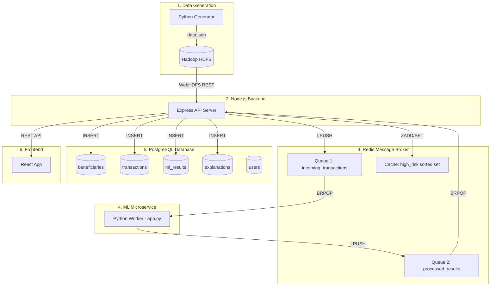
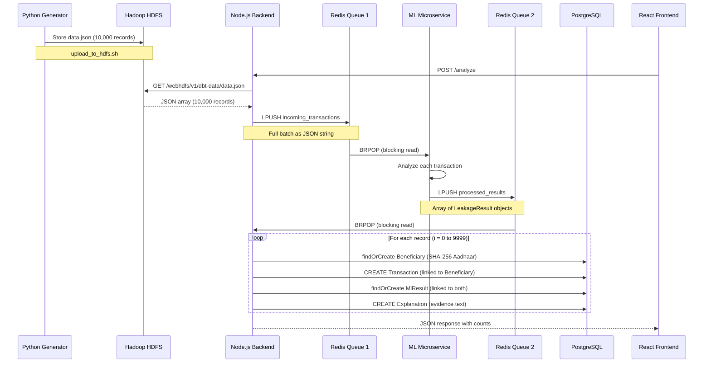
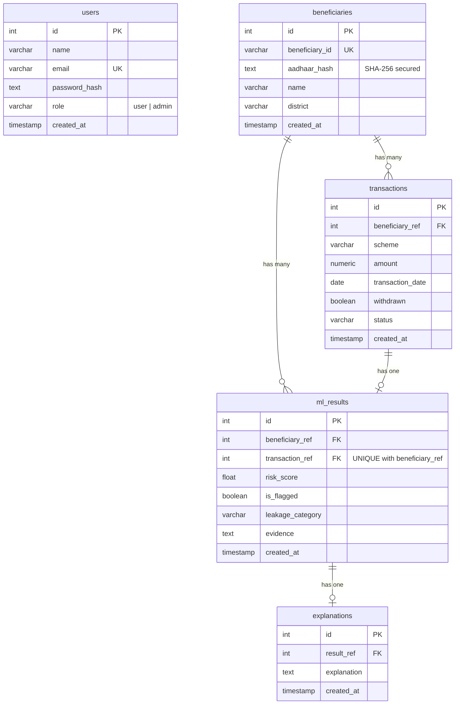

# DBT Leakage Detection System — Backend

A distributed, microservice-based backend for detecting fund leakage in government Direct Benefit Transfer (DBT) schemes. Raw transaction data flows from Hadoop through Redis-brokered ML analysis into a normalized PostgreSQL database, exposed via REST APIs for React dashboards.

---

## System Architecture



---

## Data Flow — Step by Step



---

## Queue Parameter Specifications

### Queue 1: `incoming_transactions` (Node → Redis → ML)

What Node.js pushes after fetching from Hadoop:

| Field | Type | Example | Description |
|-------|------|---------|-------------|
| `beneficiary_id` | string | `"B37938"` | Unique beneficiary identifier |
| `aadhaar` | string | `"644128387820"` | Raw 12-digit Aadhaar (hashed before DB storage) |
| `name` | string | `"Mahesh Patel"` | Beneficiary full name |
| `scheme` | string | `"PM-KISAN"` | Government scheme name |
| `district` | string | `"Dahod"` | District of beneficiary |
| `amount` | float | `3970.66` | Transaction amount in INR |
| `transaction_date` | string | `"2024-11-15"` | Date of transaction |
| `withdrawn` | boolean | `true` | Whether funds were withdrawn |
| `status` | string | `"SUCCESS"` | Transaction status |
| `is_deceased` | boolean | `false` | Whether beneficiary is deceased (used by ML) |

### Queue 2: `processed_results` (ML → Redis → Node)

What the ML microservice returns after analysis:

| Field | Type | Example | Description |
|-------|------|---------|-------------|
| `beneficiary_id` | string | `"B37938"` | Same ID from Queue 1 (used to link records) |
| `aadhaar_masked` | string | `"********7820"` | Masked Aadhaar (last 4 digits only) |
| `risk_score` | float | `85.42` | ML-assigned risk score (0–100) |
| `is_flagged` | boolean | `true` | `true` if risk_score >= 80 |
| `leakage_category` | string\|null | `"Deceased Beneficiary"` | Type of fraud detected, null if clean |
| `evidence` | string | `"Active withdrawals for deceased..."` | Human-readable explanation of the flag |

---

## Database Schema (Normalized)



### How Data Maps to Tables

| Queue 1 Field | Stored In | Column |
|---------------|-----------|--------|
| `beneficiary_id` | `beneficiaries` | `beneficiary_id` (UNIQUE) |
| `aadhaar` | `beneficiaries` | `aadhaar_hash` (SHA-256 hashed) |
| `name` | `beneficiaries` | `name` |
| `district` | `beneficiaries` | `district` |
| `scheme` | `transactions` | `scheme` |
| `amount` | `transactions` | `amount` |
| `transaction_date` | `transactions` | `transaction_date` |
| `withdrawn` | `transactions` | `withdrawn` |
| `status` | `transactions` | `status` |

| Queue 2 Field | Stored In | Column |
|---------------|-----------|--------|
| `risk_score` | `ml_results` | `risk_score` |
| `is_flagged` | `ml_results` | `is_flagged` |
| `leakage_category` | `ml_results` | `leakage_category` |
| `evidence` | `ml_results` | `evidence` |
| `evidence` | `explanations` | `explanation` (copy for XAI table) |

---

## Project File Structure

```
backend/
├── config/
│   ├── db.js                    # Sequelize PostgreSQL connection pool
│   └── redis.js                 # ioredis client with retry strategy
│
├── controllers/
│   ├── dataController.js        # POST /analyze — full pipeline orchestrator
│   └── apiController.js         # GET endpoints — dashboard, fraud, search, analytics
│
├── models/
│   ├── index.js                 # Registers all 5 models + defines relationships
│   ├── User.js                  # users table (admin/user login)
│   ├── Beneficiary.js           # beneficiaries table (core identity)
│   ├── Transaction.js           # transactions table (raw financial data)
│   ├── MlResult.js              # ml_results table (fraud analysis output)
│   └── Explanation.js           # explanations table (evidence/XAI text)
│
├── routes/
│   └── index.js                 # Express router mapping URLs to controllers
│
├── services/
│   ├── hadoopService.js         # WebHDFS REST client (fetches from HDFS)
│   └── mlService.js             # Redis Queue producer/consumer bridge
│
├── utils/
│   └── helpers.js               # Logger, chunk array, async retry utilities
│
├── scripts/
│   ├── generate_data.py         # Creates 10,000 realistic DBT transaction records
│   ├── init.sql                 # PostgreSQL schema (5 normalized tables + indexes)
│   └── upload_to_hdfs.sh        # Copies data.json into Hadoop container → HDFS
│
├── ml-service/
│   ├── app.py                   # Python ML worker (BRPOP Q1 → analyze → LPUSH Q2)
│   ├── Dockerfile               # Python container build config
│   └── requirements.txt         # Python dependencies (redis)
│
├── server.js                    # Express app entry point
├── docker-compose.yml           # 6 containers: Node, ML, Redis, Postgres, Namenode, Datanode
├── Dockerfile                   # Node.js container build config
├── package.json                 # Node.js dependencies
├── .env                         # Environment variables (DB, Redis, Hadoop URLs)
└── .env.example                 # Template for .env
```

---

## API Endpoints

### Pipeline

| Method | Endpoint | Description |
|--------|----------|-------------|
| `POST` | `/analyze` | Runs full pipeline: HDFS → Q1 → ML → Q2 → PostgreSQL |
| `POST` | `/load-from-hadoop` | Verifies HDFS connectivity and record count |

### Dashboard

| Method | Endpoint | Description |
|--------|----------|-------------|
| `GET` | `/dashboard` | Returns total counts and risk breakdown |

### Fraud Cases

| Method | Endpoint | Description |
|--------|----------|-------------|
| `GET` | `/fraud-cases` | All flagged cases with Beneficiary + Transaction + Evidence |
| `GET` | `/fraud/:id` | Single case by transaction ID |

### Beneficiary

| Method | Endpoint | Description |
|--------|----------|-------------|
| `GET` | `/beneficiary/:beneficiaryId` | Full profile: identity + transactions + ML results + evidence |
| `GET` | `/search?q=<query>` | Search by name or beneficiary_id (partial match) |

### Admin

| Method | Endpoint | Description |
|--------|----------|-------------|
| `GET` | `/admin/analytics` | Category breakdown, district stats, top flagged beneficiaries |

---

## Docker Containers

| Container | Image | Port | Purpose |
|-----------|-------|------|---------|
| `dbt_backend` | Node.js (custom) | 8080→5000 | Express API server |
| `dbt_ml_service` | Python (custom) | — | Redis queue ML worker |
| `dbt_postgres` | postgres:15-alpine | 5432 | Normalized database |
| `dbt_redis` | redis:7-alpine | 6379 | Message broker + cache |
| `dbt_hadoop_namenode` | bde2020/hadoop-namenode | 9870, 9000 | HDFS metadata node |
| `dbt_hadoop_datanode` | bde2020/hadoop-datanode | — | HDFS data storage |

---

## Setup & Run Instructions

```bash
# 1. Start all containers (clean build)
docker compose down -v
docker compose up --build -d

# 2. Wait 30-40 seconds for Hadoop to initialize, then:

# 3. Generate test data
source venv/bin/activate
python3 scripts/generate_data.py --output data.json

# 4. Upload to Hadoop
bash scripts/upload_to_hdfs.sh

# 5. Run the full analysis pipeline
curl -X POST http://localhost:8080/analyze

# 6. Verify results
curl http://localhost:8080/dashboard
curl http://localhost:8080/fraud-cases
curl http://localhost:8080/beneficiary/B37938
curl http://localhost:8080/search?q=Patel
curl http://localhost:8080/admin/analytics
```

---

## Security

- **Aadhaar Protection**: Raw Aadhaar numbers are NEVER stored in PostgreSQL. Node.js hashes them with SHA-256 before insertion into `beneficiaries.aadhaar_hash`.
- **Duplicate Prevention**: `beneficiaries.beneficiary_id` has a UNIQUE constraint. `ml_results` has a composite UNIQUE on `(beneficiary_ref, transaction_ref)`. Both use `findOrCreate` to silently skip duplicates.
- **Role-Based Access**: The `users` table supports `user` and `admin` roles for future JWT-based authentication.

---

## Environment Variables

| Variable | Default | Description |
|----------|---------|-------------|
| `PORT` | `5000` | Node.js server port |
| `DB_HOST` | `postgres` | PostgreSQL hostname |
| `DB_PORT` | `5432` | PostgreSQL port |
| `DB_USER` | `postgres` | PostgreSQL username |
| `DB_PASSWORD` | `postgres` | PostgreSQL password |
| `DB_NAME` | `dbthackathon` | PostgreSQL database name |
| `REDIS_HOST` | `redis` | Redis hostname |
| `REDIS_PORT` | `6379` | Redis port |
| `HADOOP_URL` | `http://hadoop-namenode:9870` | Hadoop WebHDFS base URL |
